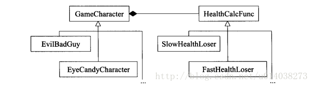
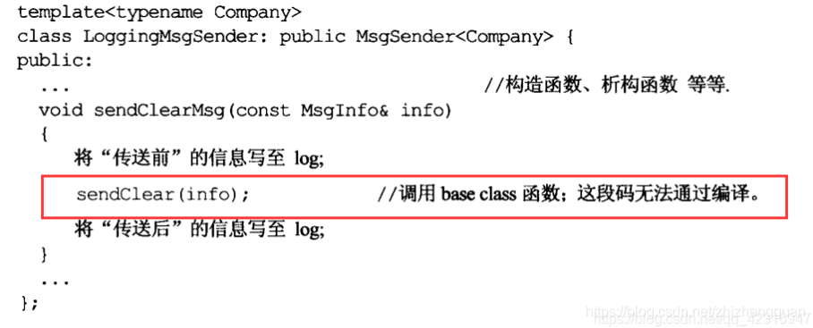
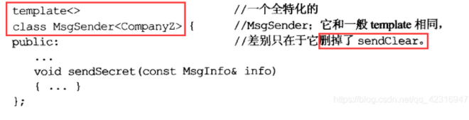
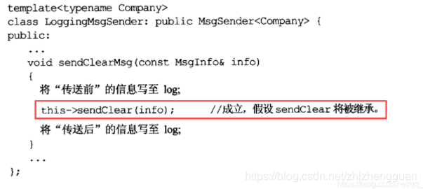
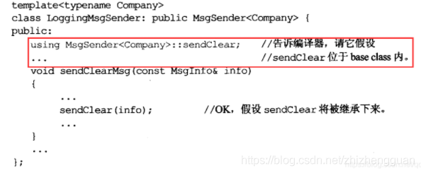
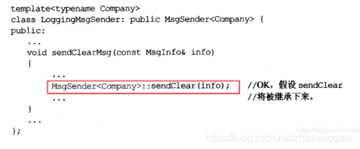

# 1.让自己习惯C++

* ## <u>条款01：视C++为一个语言联邦</u>

    	C++并不是一个带有一组守则的一体语言：他是从四个次语言**（C、Object-Oriented C++、Template C++、STL）**组成的联邦政府，每个次语言都有自己的规约。记住四个次语言就会发现C++容易了解得多。

> 注：书中提到对于内置类型传值比传引用快：
>
> **传引用时只在栈上为实参分配一个指针的存储空间，函数调用时只把实参的指针传递进来了（引用实际上是不易出错的指针）。**  
> “传值”对于一般大对象而言，传递的大小总是大于“传引用”，但对于小对象，例如char，“传值”会比“传引用”更高效。
>

---


* ## <u>条款02：尽量以const、enum、inline替换#define</u>

这个条款或许改为“宁可以编译器替换预处理器”比较好，因为或许`#define`不被视为语言的一部分。这正是问题所在。

`#define ASPECT_RATIO 1.653`

	记号名称`ASPECT_RATIO`或许从来未被编译器看到；也许编译器开始处理源码之前他就被移走了。于是记号有可能没进入记号表内。

如果出现了编译错误，那么编译器会提示错误信息1.653，而不是 ASPECT_RATIO ，你会感到非常困惑.

	解决之道是用常量替换上述的宏：
	
	`cosnt double AspectRatio = 1.653;  //大写名称通常用于宏，这里用大驼峰`

作为语言常量，它肯定会被编译器看到。而且有可能比#define导致较小的代码量

**两种特殊情况**

1. 定义常量指针

    由于常量定义式通常放在头文件，因此有必要将指针声明为const，且两次

    即：`const char* const autoName = "Lxr"`

    上述改为使用string更好：`const std::string autoName("Lxr");`
2. class专属常量

    ```cpp
    class GamePlayer{
    private:
       static const int NumTurns = 5;//这是声明不是定义
       int scores[NumTurns];
    }
    通常对C++来说使用任何东西都要提供定义式，但如果是class专属常量且是static且为整数类型(如：int，char，bool)，需要特殊处理。
        只要不取地址就不需要定义上述声明就够了。
        如果非要取地址，在实现文件(而非头文件)中定义 const int GamePlayer::NumTurns;  声明时有初值所以此处不需要
    ```

3. 顺带一提

    无法利用宏创建class专属常量，因为#define不重视作用域，不提供封装性

4. 旧的编译器可能不支持上述语法，所以写成声明在头文件内，不赋值，定义赋值写在实现文件内。
5. 还可以使用“the enum hack”

    ```cpp
    class A{
    private:
        enum {numTurns = 5};
        int socres[numTurns];
    }
    ```

    1. enum hack不允许取地址，如果你不想让别人指针获得一个指向你的整数常量
    2. 非常实用
6. 对于形似函数的宏，最好改用inline函数替换宏

    ---

* ## <u>条款03：尽可能使用const</u>

         const出现在星号左边表示被指物为常量，出现在星号右边表示指针本身是常量，出现在两边表示两者兼备。

	下边两种写法是一样的，都在星号左边。

```cpp
void f1(const Widget* pw);
void f2(Widget const * pw);
```

        如果希望迭代器所指的东西的值不能改变，使用const_iterator。
    
        令函数返回一个常量值，往往可以降低因客户错误而造成的意外。

**const成员函数**

> 将const实施于成员函数的目的是为了明确该成员函数可作于用const对象身上：
>
> 		1. 他们使class接口比较容易理解
>	
> 		2.他们使得可以操作const对象（const对象不能调用非const成员函数）
>
> const成员函数和no-const函数可以重载。operator[ ]返回引用，不然操作的是副本，没意义
>
> 定义类内变量可以对某些使用mutable关键字，使得在const函数中可以更改。
>

**在const和non-const成员函数中避免重复**

> 假设要考虑到边界检验，日志数据访问，检验数据完整性。分别写到两个函数中，会导致代码很大。
>
> 所以可以令non-const调用const来处理代码重复问题。
>

```cpp
class TextBlock{
public:
    ...
    const char& operator[](std::size_t position) const{
	...
	...
	return text[position];
    }
    char& operator[](std::size_t position){
	return 
	  const_cast<char&>( static_cast<const TextBlock&>(*this)[position] );
    }
}
```

用non-const调用const。如果只是单纯的调用operator[ ]会递归调用自己。因此先转化为const TextBlock&类型，然后调用【】，最后移除const

如果反过来令const调用non-const不行

---


* ## 条款04：确定对象使用前被初始化

永远在使用对象之前将它初始化。

> 对于内置类型，必须手工完成此事。
>
> 对于以外的类型，确保每一个构造函数都将对象的每一个成员初始化。
>

```cpp
最佳构造方法：成员初始化列。避免default构造函数一切作为被浪费
//有参构造
ABEntry::ABEntry(const std::string& name, const std::string& address, const std::list<PhoneNumber>& phones)
          :theName(name), theAddress(address),thePhone(phones),numTime(0)
          {}
//无参构造
ABEntry::ABEntry()  //调用他们的默认构造函数
          :theName(), theAddress(),thePhone(),numTime(0)
          {}
```

**有些情况必须用初值列**

> 如果成员变量是const或reference，他们就一定需要初值，不能被赋值。
>

*注：尽量按照声明的次序将他们条列到成员初始化列时。*


> **static对象如果出现在类中，那么该对象即使从未被使用到，它也会被构造以及析构。而函数中的static对象，如果该函数从未被调用，这个对象也就绝不会诞生，但是在函数每次被调用时检查对象是否需要诞生。**
>

函数内的static对象被称为local static对象，其他的被称为non-local static对象(global、namespace内，class内)

**问题出现了：**

	如果某个编译单元内的某个non-local static对象的初始化动作使用了另一编译单元内的某个non-local static对象，她所用到的这个对象尚未被初始化。（因为对于不同单元内的non-local static对象并未规定初始化次序）。

**解决方案**：

	将每个non-local static对象搬到自己的专属函数内，这些函数返回一个引用指向对象(即单例模式)。保证了调用时肯定初始化。

```cpp
class A{
public:
   ...
   ...
   static A& get_A(){
      static A a;
	return a;
  }
private:
  构造函数，保证外部不能创建对象A
}
```

# 2：构造析构赋值运算

## 条款05：了解C++默默编写并调用了那些函数

	如果你不定义，编译器会自动帮你实现默认构造、析构、拷贝构造、拷贝赋值运算符。当然唯有这些函数被需要的时候，才会被创建出来。

以下情况不会生成默认的拷贝赋值运算符

1. 类中含有**引用**的成员变量（绑定后不可变）
2. 类中含有**const**的成员变量（同上）
3. 类的**基类**中的拷贝赋值运算符是**私有**的。(因为派生类想象中可以处理基类成分，但是没有操作权限)

## 条款06：若不想使用编译器自动生成的函数，就该明确拒绝

	如果想要某些东西独一无二，应该让拷贝动作失败。
	
	可以将拷贝构造函数和拷贝赋值运算符声明为private。或者继承自前述的类。

## 条款07：为多态基类声明virtual析构函数

	当基类中含有堆区成员变量，为了避免局部销毁(派生类调用的是基类的析构)。

：给base class一个virtual析构函数，vritual函数的目的就是允许派生类的实现得以客制化

*注意*：只有当class内至少含有一个virtual函数，才为他声明virtual析构函数。

纯虚函数导致抽象类，即不能被实体化。注意要为纯虚函数提供定义，不能只 = 0就完了

## 条款08：别让异常逃离析构函数

*C++不禁止析构函数吐出异常，但他不鼓励这样做。*

如果析构函数必须执行一个动作，而该动作可能抛出异常，怎么办？

> 第一个办法：调用std::abort()
>
> ```cpp
> try{
>   db.close();
> }catch(...){
>    std::abort();
> }
> ```
>
> 第二个办法：重新设计close函数
>
> 把close单独拿出来作为一函数，函数内对象调用close并将flag设置为true
>
> 然后判断flag，如果flag == false，再关闭一次还不能关掉就报异常，
>

## 条款09：绝不在构造或析构过程中调用virtual函数

派生类的构造函数一定会先调用基类的构造函数，则基类中虚函数被调用，而不是派生类中虚函数。

> 在base class构造期间，virtual函数不是virtual函数
>

改进方法：将基类虚函数拎出来并声明为纯虚函数(不会执行)，声明一个init函数供构造函数调用，init调用虚函数

改进方法二：将此函数的参数设置为不同的，不同派生类类传入不同的信息参数，即从下往上传递。构造时调用并传参。

## 条款10：令operator= 返回一个reference to *this

```cpp
class A{
   A& operator = (int rhs){
      ...
      return *this;
   }
}
```

## 条款11：在operator= 中处理自我赋值

```cpp
//情况一
class Widget {...};
Widget w;
...
w = w;

//情况二
a[i] = a[j]; //i == j;

//情况三
*px = *py; //指向同一东西
```

改进的operator=

```cpp
Widget& widget::operator= (cosnt Widget& rhs){
	if(this == &ths) return *this; //证同测试
	delete pb;
	pb = new Bitmap(*rhs.pb); //如果构造异常也会有问题，指向被删除的内存
	return *this;
}
```

再次改进

```cpp
Widget& widget::operator= (cosnt Widget& rhs){
	Bitmap* pOrig = pb;//记住原先的
	pb = new Bitmap(*rhs.pb); //令其指向一个副本
	delete pOrig; //构造失败就不删除了
	return *this; //构造失败返回的也是返回的自己
}
```

**改进：使用copy and swap技术**

```cpp
Widget& widget::operator= (cosnt Widget& rhs){
	Widget temp(rhs);
	swap(temp);
	return *this;
}
```

## 条款12：复制对象时勿忘其每一个成分

每有一个成员变量，拷贝时就要考虑到

派生类在拷贝赋值或拷贝成员时，要注意调用基类的拷贝和构造

由于base class的成员往往是private，无法直接访问，只能调用基类相关函数。

**拷贝构造函数，在初始化列表中调用基类拷贝构造**

**拷贝赋值运算符，在函数体内调用基类的**

不要为了代码重复，令拷贝构造和拷贝赋值相互调用。

# 3：资源管理

## 条款13：以对象管理资源

```cpp
auto_ptr只能一个指向，若复制，则被复制者变成null

std::shared_ptr<T>a(func()); //func创建堆区对象

当a离开作用域后，引用计数减1，为0自动delete对象。
```

注：智能指针析构函数内只做delete，不做delete[ ]。

## 条款14：在资源管理类中小心copying行为

在我们管理RALL（构造函数中获得，析构函数中释放）观念类的时候，不同情况，不同处理

* 不能同步的资源将copy操作声明为private
* 希望同步的资源，采用引用计数
* 深拷贝
* 转移拥有权auto_ptr

智能指针的第二参数，可以实一个函数名称，这个函数负责删除(例如互斥量加锁或解锁)

## 条款15：在资源管理类中提供对原始资源的访问

	APIs往往要求访问原始资源，所以每一个RALL应该提供一个“取得其所管理资源”得办法。
	
	对原始资源得访问可能经由显示转换(函数)或隐式转换(仿函数)。一般显式转换比较安全，隐式转换对客户比较方便。

## 条款16：成对使用new和delete用相同形式

new和delete得形式必须相同

## 条款17：以独立语句将newed对象置入智能指针

以独立语句将newed对象存储于智能指针内，不这样做可能抛出异常

```cpp
processWidget(std::tr1::shared_ptr<Widget>(new Widget), priority())
注意
执行“new Widget”
调用shared_ptr构造函数执行priority()
上述三件事得执行顺序是不能确定的，别看new Widget在指针指针的构造函数内
```

**改进**

```cpp
//在单独语句内以指针指针存储newed对象
std::str1::shared_pre<Widget> pw(new Widget);

process(pw, priority()); //不至于造成泄露
```

# 4：设计与声明

## 条款18：让接口容易被正确使用不易被误用

避免无端与内置类型不兼容，真正的理由是为了提供行为一致的接口。

tr1::shared_ptr支持定制删除器

```cpp
1、当作为对象时，第二参数即为删除器
2、当为返回类型时，可以这样
std::tr1::shared_ptr<Investment> createInvestment()
{
  std::str1::shared_ptr<Investment>retVal(static_cast<Investment*>(0), getRidOfInvest);
   retVal = ...//令其指向正确对象
	return retval;
}
```

share_ptr得某一个构造函数接收两个实参：一个是被管理的指针，另一个是引用计数变为0的删除器。

## 条款19：设计class犹如设计type

需要考虑一下问题来设计一个type

* 新type对象如何被创建和销毁
* 对象的初始化和赋值该有什么样的差别
* 新type对象如果被pass by value意味着什么
* 什么是新type的“合法值”
* 你的新type需要配合某个继承体系吗
* 你的新type和别的type需要什么样的转换
* 什么样的操作符和函数对于新type是合理的
* 什么样的标准函数应该驳回？即那些声明为private
* 谁该取用新type的成员
* 什么是新type的“未声明”接口
* 你的新type有多么一般化
* 真的需要一个新type吗

## 条款20：宁以传引用常量代替传值

传引用可以避免调用拷贝构造函数(如果有基类消耗更大)，和析构函数

这个规则不适用于**内置类型、STL函数的迭代器和函数对象**

## 条款21：必须返回对象时，别妄想返回其引用

              绝对不要反悔指针或引用指向一个局部变量，不管他是在堆区还是栈区

不要返回一个局部static对象，因为有可能需要很多份

## 条款22：将成员变量声明为private

其实访问权限只有两种：private（提供封装）和其他（不提供封装）

切记将成员变量声明为private，这可赋予客户数据访问的一致性。

protect封装性并不比public好多少。

## 条款23：宁以non-member, non-friend替换member函数

一个函数要调用多个memeber函数。可以将其声明为non-member这样她就不会访问私有变量，增加了封装性。

non-member通过对象参数完成功能，且不会访问私有成员变量。

## 条款24：若所有参数皆需类型转换，请为此采用non-member函数

例如operator*写在类内只需要传一个参数，但是如果调用者是隐式转化前的类型，则不能成立。

写在类外，传入两个对象参数，随便发生隐式转换都可以，无所谓谁调用谁。

总结：某函数所有参数或只有this指针所指的因与参数，要进行类型转换，必须是个non-member

## 条款25：考虑写出一个不抛异常的swap函数

缺省的版本就是借助temp实现交换。

**改进**：声明一个public swap函数并且不抛出异常，在类的命名空间提供一个non-member函数，并令它调用swap函数

```cpp
记得using namespace std; 让编译器自己选择合适的版本
namespace std{   //特化版本
   template<>
   void swap<Widget>(Widget& a, Widget& b){ a.swap(b);}
}
```

如果Widget类是类模板，类型为T

上述的Widget不能加T，因为**偏特化一个函数模板是不合法**的，不能通过编译

惯常做法：添加一个重载版本，

```cpp
namespace std{
    template<typename T>
    void swap (Widget<T>&a, Widget<T>&b){
     a.swap(b);
     }
}
```

std是不能自己添加东西的，所以改名，里边放member和non-member的特化swap

# 5：实现

## 条款26：尽可能延后变量定义式的出现时间

定义一个变量就得承受这个变量的构造和析构成本，所以尽量延后时间定义，避免出现定义了却没有使用的浪费。

## 条款27：尽量少做转型动作

旧式转型是C风格的转型。

1. const_cast通常被用来将对象的常量性移除。他也是唯一有此能力的C++-style转型操作符
2. dynamic_cast主要用来执行安全向下转型，也就是用来决定某对象是否归属继承体系中的某个类型
3. reinterptrt_cast意图执行低级转型，实际动作取决于编译器，即不可移植。例如int*转化为int
4. static_cast用来强迫执行隐式转换，将non-cosnt转化为const(不能反过来)，int转化为double

子类想要调用父类的函数，不要将this转化为基类的再调用，直接使用类名::函数名调用即可。

## 条款28：避免返回handles指向对象内部成分

handlers（reference、指针、迭代器）

即使函数是const，不能更改成员变量，但是返回handlers后他们只想了成员，导致可以更改，封装性降低了。

避免不是不可以，operator[ ]就必须返回引用。

## 条款29：为“异常安全”而努力是值得的

异常安全函数提供以下三个保证之一：基本承诺：如果异常被抛出，程序内的任何事物仍然保持在有效状态下。没有任何对象或数据会因此而败坏，所有对象都处于一种内部前后一致的状态。然而程序的现实状态恐怕不可预料强烈保证：如果异常被抛出，程序状态不改变。调用这样的函数需要有这样的认知：如果函数成功，就是完全成功，如果函数失败，程序会恢复到“调用之前”的状态不抛掷保证：承诺绝不抛出异常，因为它们总是能够完成他们原先承诺的功能。作用于内置类型身上所有操作都提供nothrow保证，这是异常安全码中一个必不可少的关键基础材料

这三种保证是递增的关系，但是如果我们实在做不到，那么可以提供第一个基本承诺，我们在写的时候应该想如何让它具备异常安全性

```
    1. 首先以对象管理资源可以阻止资源泄漏
    2. 在你能实现的情况下，尽量满足以上的最高等级
```

例如：将加锁和解锁封装到类中，通过局部对象调用，这样就省的两步了，程序结束自动解锁

## 条款30：透彻了解inline的里里外外

inline 声明的两种方式：

```
    1. 隐喻的inline申请，即把定义写在class内部
    2. 明确声明，即在定义式前加上关键字inline
```

将大多数inlining限制在小型、被频繁调用的函数身上。这可使日后调试和二进制升级更容易，也可使得潜在的代码膨胀问题最小化。不要只因为function templates出现在头文件，就将他们声明为inline

## 条款31：将文件的编译依存关系降至最低

为了避免在头文件中#include#然后在使用。

有人提出我只做前置声明，然后在下边类中直接引用。

> 想法存在两个问题
>
> 1、string不是一个class而是一个typedef，所以用前置声明不对。只能引入头文件
>
> 2、编译期间必须知道对象大小：如果不列出实现细目，编译器无法分配空间
>

**pImpl手法**

头文件包括前置声明，以及我们需要的类，类中有一个pimpl类类型指针

实现文件包括一个pimpl类的实现，需要的类的实现，以及前置声明的类的实现。

总结：让依赖的头文件，在本头文件中只声明，然后在实现类中做实现。这样依赖与实现文件产生了关系，而不是与头文件产生关系。

# 6：继承于面向对象设计

## 条款32：确定你的public继承模型塑模出is-a关系

public继承主张，能够施行于base class对象身上的每件事情，也可以施行于derived class对象身上，所以派生类无法实现的函数，基类最好也不要定义。

## 条款33：避免遮掩继承而来的名称

派生类内的名称会遮掩基类的名称，导致派生类对象无法调用基类的（被重载）函数，即使参数传对了也报错。

改进方法1：在派生类内using Base::func ;

改进方法2：在派生类同名函数中调用基类函数（即暗自成为inline），注意是private继承

## 条款34：区分接口继承和实现继承

* public继承下基类成员函数的接口总是会被继承
* 声明一个纯虚函数就是为了让派生类只继承函数接口（必须实现重写）
* 抽象类可以定义一个对象，但是对象不能用。
* 声明非纯虚函数是为了让derived classes继承该函数的接口和缺省实现
* 非不函数具体指定接口和强制实现继承（重写了也不会调用）

## 条款35：考虑virtual函数以外的其他选择

* **藉由Non-Virtual Interface手法实现Template Method模式**

  ```cpp
  class GameCharacter{
  public:
      int healthValue()const{
          ...
          int retVal=doHealthValue();
          ...
          return retVal;
      }
      ...
  private:
      virtual int doHeatlthValue() const{
          ...
      }
  };
  ```

                这种设计，“令用户通过public non-virtual方法调用private virtual函数”，称为non-virtual interface（NVI）手法，这是所谓的Template Method设计模式（与C++ templates并无关联）的一个独特表现形式，我把这个non-virtual函数（healthValue）称为virtual函数的外覆器（wrapper）。

  优点：可以在...处做一些事前工作和事后工作，确保设定好适当场景。

  注意：重新定义private virtual函数

  注意：NVI没必要一定是private，为了让子类调父类某些函数，就得是protect继承。
* **藉由Function Pointers实现Strategy模式**

  ```cpp
  class GameCharacter;
  int defaultHealthCalc(const GameCharacter& gc);
  class GameCharacter{
  public:
      typedef int(*HealthCalcFunc) (const GameCharacter);
      explicit GameCharacter(HealthCalcFunc hfc=defaultHealthCalc):health(hcf)
      {}
      int healthValue() const{
          return healthFunc(*this);
      }
      ...
  private:
      HealthCalcFunc healthFunc;
  };
  ```

  这个做法是Strategy设计模式的额简单引用，拿它和“植基于GameCharacter继承体系之virtual函数”的做法比较，它提供了某些有趣弹性：

  1）同一人物类型之间的不同实体可以有不同的健康计算函数，如：

  ```cpp
  class EvilBadGuy:public GameCharacter{
  public:
      explicit EvilBadGuy(HealthCalcFunc hcf=defaultHealthCalc):GameCharacter(hcf)
      {...}
      ...
  };
  int loseHealthQuickly(const GameCharacter&);
  int loseHealthSlowly(const GameCharacter&);
  
  EvilBadGuy ebg1(loseHealthQuickly);
  EvilBadGuy ebg2(loseHealthSlowly);
  ```

  2）某已知人物之甲亢支书计算函数可在运行期变更，例如GameCharacter可以提供一个成员函数setHealthCalculator，用来替换当前的支书计算函数。

  唯一能够解决“需要以non-member函数访问class 的non-public成分”的办法就是：弱化class的封装。例如class可以声明那个non-member函数为friends，或是为其实现的某一部分提供的public访问函数（其他部分则宁可各自拥有自己的健康计算函数和“可在运行期间改变的计算函数”）是否足以弥补缺点（例如可能必须降低GameCharacter的封装性），是你必须更具每个设计情况的不同而需要加以抉择的。
* **藉由tr1::function完成Strategy模式**

           一旦习惯了templates以及他们对隐式接口的使用，基于函数指针的做法看起来便过分苛刻死板了，为什么要求“HealthCalcFunc”必须是个函数，而不能是某种“像函数的东西”呢？如果一定需要是函数，威慑么不能够是个成员函数？威慑么一定得返回int而不是任何可以被转换为int的类型呢？  
           如果我们不再使用函数指针，改用一个类型为trl::function的对象那个，这些约束就全都会发不见了，这样的对象可以持有（保存）任何可调用物（callable entity，也就是函数指针、函数对象或者成员函数指针），只要其签名式兼容于需求端，以下将刚才的设计改为使用trl::function:
* ```cpp
  class GameCharacter;
  int defaultHealthCalc(const GameCharacter& gc);
  class GameCharacter{
  public:
      任何兼容于GameCharacter植物，返回任何兼容于int的东西
      typedef std::trl::function<int (const GameCharacter&> HealthCalcFunc;
      explicit GameCharacter(HealthCalcFunc hcf=defaultHealthCalc):heathFunc(hcf)
      {}
      int healthValue() const
      {
          return healthFunc(*this);
      }
      ...
  private:
      HealthCalcFunc healthFunc;
  };
  ```

       此时HealthCalcFunc是个typedef，用来表现trl::function这个具现体，意味着具现体的行为像一般的函数指针，现在让我们瞅瞅HealthCalcFunc是个怎样的typedef:

`std::trl::function<int  (const GameCharacter&)>`

        这里我们将trl::function具现体的目标签名式（target signature）以不同的颜色强调出来，这个签名代表的函数是“接受一个reference指向const的GameCharacter，并返回int”，这个trl::function类型（也就是这里的HealthCalcFunc类型）产生的对象那个可以保存任何与此签名式兼容的可调用物（callable entity，即函数指针、函数引用或者成员函数引用），**所谓兼容，意思就是这个可调用误的参数可以被隐式转换为const GameCharacter&，而其返回类型可被隐式转换为int。这种设计相较与前一个设计只是让GameCharacter保存一个trl::function对象，相当于一个指向函数的泛华指针，这个改变如此细小，我总说它没有任何外显影响，除非客户在“指定健康计算函数”这件事情上面需要更惊人的弹性。**

```cpp
short calcHeatlth(const GameCharacter&);

struct HealthCalculator{
    int operator()(const GameCharacter&) const
    {
        ...
    }
};
class GameLevel{
public:
    float health(const GameCharacter&) const;
    ...
};
class EvilBadGuy:public GameCharacter{
    ...
};
class EyeCandyCharacter:public GameCharacter{
    ...
}; 
EvilBadGuy ebg1(calcHealth);   //人物1：传函数指针
EyeCandyCharacter eccl(healthCalculator()); //人物2：传函数对象
GameLevel currentLevle;   //人物3：使用成员函数
...
EvilBadGuy ebg2(std::trl::bind(&GameLevel::health,currentLevle,_1));
```

* 古典的Strategy模式

  

  上图表示的是GameCharacter作为基类，EvilBadGuy和EyeCandyCharacter作为GameCharacter的派生类，同时HealthCalcFunc作为基类，SlowHealthLoser和FastHealthLoser作为HealthCalcFunc，然后GameCharacter中有一个HealthCalcFunc指针的成员变量，看看如下代码：

  ```cpp
  class GameCharacter;
  class HealthCalcFunc{
  public:
      ...
      virtual int calc(const GameCharacter& gc)const{
      {...}
      ...
  };
  HealthCalcFunc defaultHealthCalc;
  class GameCharacter{
  public:
      explicit GameCharacter(HealthCalcFunc* phcf=&defaultHealthCalc):pHealthCalc(phcf)
      {}
      int healthValue()const
      {
          return pHealthCalc->calc(*this);
      }
      ...
  private:
      HealthCalcFunc* pHealthCalc;
  };
  ```

          这种设计方法的吸引力在于，熟悉标准的Strategy模式的人很容易辨认它，而且它还提供“讲一个即有的健康算法纳入使用”的可能性—只要为HealthCalc继承体系中添加一个derived class即可。

## 条款36：绝不重新定义继承来的非虚函数

静态绑定，只看左边。重新定义了也没什么用，无法实现多态

## 条款37：绝不重新定义继承来的缺省参数

virtual函数是动态绑定，而缺省的参数值却是静态绑定的。意思是“调用定义于派生类内的虚函数，却使用基类为它指定的缺省参数值”。

	原因：在于运行期效率，如果缺省参数动态绑定，编译器就得决定适当的缺省参数值。比“在编译期决定”慢。

## 条款38：通过复合塑模出has-a或“根据某物实现出”

复合是类型关系的一种，即某类型对象内涵其他类型的对象

例如set和链表的关系。

## 条款39：明智而审慎的使用private继承

如果class之间的继承关系是private，编译器不会将一个derived class对象转化为一个base class对象。

* 当派生类需要访问基类的保护成员或需要重新定义继承来的virtual时，是合理的
* private继承可以造成空基类的最优化，这对致力于“对象尺寸最小化”的程序库开发者很必要。

## 条款40：明智而审慎的使用多重继承

1. 多重继承首先带来一个问题。子类会从多个父类继承相同的名称。这样在调用的时候，必然导致歧义
2. 考虑Base1中有个public方法XXX，Base2中有个private方法XXX，Derived继承Base1和Base2，那么分析一下，Derived d; d.XXX()到底调用哪个方法？

    　　你可能会想，虽然两个都匹配，但是只有Base1的XXX方法可访问，因此调用Base1的XXX方法。这种想法是错的，编译报错：对XXX的访问不明确。为什么？

        　　因为编译器决议调用哪个方法的时候，第一步，先把所有匹配的名称都拿来，不管是不是可以访问，然后在里面找到一个最优匹配，如果两个匹配程度一样，编译器就傻眼了，只能报错。再退一步说，C++过载不能跨域，即只能在当前类中过载。经过测试，从多个父类继承相同的名称，即使匹配程度不一样，也会导致对XXX的访问不明确。
        
        　怎么解决这个问题呢？
        
        　　明确告诉编译器，我要调用哪个父类的方法。
        
        　　d.Base1::XXX(); //OK
        
        　　d.Base2::XXX(); //Error，无法访问成员XXX
        
        　　注：单一继承也可以使用d.Base1::XXX();这种形式。
        
        　　还有一个办法，子类定义一个XXX方法，隐藏两个父类的XXX方法，这样就不存在不明确的调用了。
3. 钻石型多继承，考虑InputFile继承File，OutputFile继承File，IOFile继承InputFile和OutputFile，File中有个数据fileName，现在出问题了。从继承角度讲，IOFile有两份fileName，但根据常识，IOFile应该只有一个fileName。C++默认的做法是IOFile中有两个fileName

    ```cpp
    class File {...};
    class InputFile : virtual public File {...};
    class OutputFile : virtual public File {...};
    class IOFile : public InputFile, public OutputFile { ... };
    ```

    虽然起到了效果，但是付出了很大代价，virtual呆滞inputfile文件变大，访问变慢，初始化也可能带来诡异的问题。
4. 因此，尽量少使用virtual继承。如果必须使用virtual继承，也要保证不在virtual Base（即File）中放置数据，从而保证IOFile中没有重复的数据。C#和Java中的interface就不允许有数据。相对而言，有重复的方法，还好办，可以指定调用哪个父类的方法。
5. 那么，多重继承就一无是处吗？多重继承的使用场景：public继承一个类，暴露接口，同时private继承一个类，根据它来实现。你可能会想，根据某物实现出，不是应该优先使用复合技术吗？private继承可以解决两个问题：一是private继承可以访问protected成员，二是可以重写方法。

# 7：模板与泛型编程

## 条款41：了解隐式接口和编译期多态

面向对象编程世界总是以显式接口和运行期多态解决问题；

> template及泛型编程的世界与面向对象有根本的不同。在此世界中显式接口和运行期多态仍然存在，但是重要性降低。反倒是隐式接口和编译期多态移到前头了
>

让我们看看从函数变成函数模板时发生了什么

```cpp
template<typename T>
void doProcessing(T& w){
     if(w.size() > 10 && w != soneNastyWidget){
         T temp(w);
         temp.noemalize();
 	 temp.swap(w);
     }
}
```

* 从本例看w必须支持上述接口，重要的是这些表达式，对于T来说是一组必须支持的隐式接口。
* 涉及到w的任何函数调用有可能造成template具现化，这样的具现行为发生在编译期。
* > “以不同的template参数具现化函数模板”会导致调用不同的函数，这便是所谓的编译期多态。
  >

**显示接口和隐式接口的差异**：

显式接口由函数的签名式(函数名称、参数类型、返回类型)构成。

隐式接口不基于函数签名式，而是由有效的表达式组成。只在乎这些函数能不能用。不检查格式。

## 条款42：了解typename的双重意义

	声明模板参数时，class和typename是可以互换的，没什么不一样。
	
	template内出现的名称如果依赖于某个template参数，称为从属名称，如果从属名称在class内呈嵌套就成为嵌套从属名称。(C::const_iterator，const_iterator在C内，所以c是...)

**为了让编译器知道这是一个嵌套从属名称，必须使用typename**，其他名称不该这样

```cpp
template<typename C>
void f(const C& container,   //不允许使用 
	typename C::iterator iter); //一定要使用
```

例外情况：

在派生类的继承列表中不允许使用tyname，在构造函数初始值列表中也不允许

```cpp
template<class C>                        //声明template的参数，template和class意义相同，看个人习惯选择使用
class Derived : public Base<C>::xx      //基类列表，不允许使用typename
{
     Derived（int x）
     :  Base<C>::xx(x)
    {
         C& container                       //非嵌套从属类型名称，不需要使用typename
           Base<C>::xx    tmp                   //嵌套从属类型名称，一定要使用typename 
   }
}
```

## 条款43：学习处理模板化基类内的名称

[编译器](https://so.csdn.net/so/search?q=%E7%BC%96%E8%AF%91%E5%99%A8&spm=1001.2101.3001.7020)往往拒绝在模板化基类内寻找继承而来的名称：



**上述代码无法编译通过的原因**  
MsgSender 可能被特化，编译器无法确定 Company 有 sendClear 函数，比如 MsgSender 被特化为：



**3种解决办法**

* 在基类函数调用之前加上 “this->” :



* 使用using 声明式：



* 调用时明确写出资格修饰符：



## 条款44：将与参数无关的代码抽离template

**模板(template)** 可以 **节省时间** , 和 **避免代码重复** , 但是 **有可能导致代码膨胀** ;

在设计模板时, 需要进行**共性和变性分析(commonality and variability analysis)**, 把 **变性写入模板** , 把**共性**抽出来, 写入 **其他模板** ,

然后通过**调用**的形式, **避免代码膨胀** , 即是抽出 **模板参数无关的代码** .

可以设计一个 **基类** , 使用**私有(private)继承**的形式, 做为 **派生类的实现** , 使用**内联(inline)的形式**调用基类的函数.

基类使用**函数参数或者私有成员变量**的形式, 替换 **模板中的参数** , 进行 **函数处理** .

```cpp

//template支持n * n矩阵，元素类型是T
//size_t我们称之为非类型参数
template<typename T, size_t n>
class SquareMatrix
{
public:
	//求逆矩阵
	void invert()
	{
		cout << "求逆矩阵..." << endl;
	}
};
```

那么，使用时可以这样：

```cpp
	SquareMatrix<double, 5> sm1;
	sm1.invert();
 
	SquareMatrix<double, 10> sm2;
	sm2.invert();
```

上面实现了两个方阵，一个是5*5的，一个是10*10的，但是除了大小不同外，函数的实现逻辑完全相同，相当于有两份invert()实现逻辑被生成，

这是个典型的template编程导致的代码膨胀的例子。那么怎么做呢？很自然的想到，把那个大小变成参数不就好了吗？于是有下面的代码：

```cpp
//于尺寸无关的base class，用于正方矩阵
template<typename T>
class SquareMatrixBase
{
public:
	void invert(size_t matrixSize)
	{
		cout << "求逆矩阵..." << endl;
	}
};
 
template<typename T, size_t n>
class SquareMatrix : private SquareMatrixBase<T>
{
private:
	//避免遮掩base版的invert
	using SquareMatrixBase<T>::invert;
public:
	void invert()
	{
		//inline调用base版的invert
		this->invert(n);
	}
}
```

从上面可以看出，带参数的invert在base class中，不过它本身是个template，但是只对矩阵的元素类型参数化，所以对于给定的元素对象类型（比如double），所有

矩阵只是共享一个也是唯一一个base class，所以它们也将共享一个class内的invert。

注意这里还有两个知识点：

1.使用using声明和this->指针（请参考我的43条笔记）；

2.这里的private继承只是为了帮助derived class的实现，并不是为了表现SquareMatrix和SquareMatrixBase之间的is-a关系，所以证明private是个实现继承（详见E39条）

但是这样就够了吗？问题还有，那就是SquareMatrixBase::invert如何知道该操作什么数据呢？数据放在哪里呢？那当然添加成员变量来搞定，也是最终是实现：

```cpp
#include <string>
#include <iostream>
#include <memory>
using namespace std;
 
//于尺寸无关的base class，用于正方矩阵
template<typename T>
class SquareMatrixBase
{
public:
	SquareMatrixBase(size_t n, T *pMem)
		: size(n), pData(pMem)
	{
	}
 
	void setDataPtr(T *ptr)
	{
		pData = ptr;
	}
	void invert()
	{
		//运用size和pData求逆矩阵
		//...
		cout << "求逆矩阵..." << endl;
	}
 
private:
	size_t size;
	T *pData;
};
 
template<typename T, size_t n>
class SquareMatrix : private SquareMatrixBase<T>
{
public:
	SquareMatrix()
		: SquareMatrixBase<T>(n, 0), pData(new T[n * n])
	{
		this->setDataPtr(pData.get());
	}
	void invert()
	{
		//inline调用base版的invert
		SquareMatrixBase<T>::invert();
	}
 
private:
	unique_ptr<T[]> pData;
};
 
 
int _tmain(int argc,TCHAR* argv[])
{
	SquareMatrix<double, 5> sm1;
	sm1.invert();
 
	SquareMatrix<double, 10> sm2;
	sm2.invert();
 
	return 0;
}

```

## 条款45：运用成员函数模板接收所有兼容类型

一、添加成员函数模板

* **第一步：我们知道指针的一个特点就是：支持隐式转换** 。例如“指向non-const对象的指针可以转换为指向const对象”，“派生类指针可以隐式转换为基类指针”等等。代码如下：

```cpp
class Top {};
 
class Middle :public Top {};
 
class Bottom :public Middle {};
 
 
Top* pt1 = new Middle; //将Miffle*转换为Top*
 
Top* pt2 = new Bottom; //将Bottom*转换为Top*
 
const Top* pct2 = pt1; //将Top*转换为const Top*
```

* **第二步：** 假设现在我们设计一个模板，用来模仿智能指针类，并且希望智能指针能像普通指针一样进行类型转换。例如

```cpp
class Top {};
 
class Middle :public Top {};
 
class Bottom :public Middle {};
 
 
//自己设计的智能指针类
template<typename T>
class SmartPtr
 
{
 
public:
 
    explicit SmartPtr(T* realPtr);
 
};
 
int main()
 
{
 
    //下面是我们希望能完成的，但是还没有实现
    SmartPtr<Top> pt1 = SmartPtr<Middle>(new Middle);
  
    SmartPtr<Top> pt2 = SmartPtr<Bottom>(new Bottom);
 
    SmartPtr<const Top> pct2 = pt1;
 
    return 0;
 
}
```

* **第三步：** 根据上面的需求，我们希望让自己的智能指针类能像普通指针一样进行类型转换，那么我们可以为SmartPtr设计拷贝构造函数或拷贝赋值运算符，那么上面的功能就能实现了。

  * **一种低效的做法是：** 在SmartPtr模板中针对于每一个Top派生类定义一个拷贝构造函数和拷贝赋值运算符。但是这种做法十分低效，因为针对每一个派生类设计相对应的拷贝构造函数和拷贝赋值运算符会使class膨胀，并且如果将来加入新的派生类，那么还需要继续添加新的成员函数
* **第四步：** 另一种做法是：为SmartPtr **模板添加一个成员函数模板，** 例如：

  * 根据下面的拷贝构造函数，我们可以对任何类型T和任何类型U，将一个SmartPtr<U>转换为SmartPtr<T>
  * **下面的拷贝构造函数并未声明为explicit：** 因为原始指针类型之间的转换是隐式转换，如果我们的模板类型为原始指针，那么要支持这种隐式转换，因为我们并未声明explicit

```cpp
template<typename T>
class SmartPtr 
{
public:
    //拷贝构造函数，是一个成员函数模板
    typename<typename U>
    SmartPtr(const SmartPtr<U>& other);
 
};
```

* 根据上面的介绍我们可以知道，为类模板设计一个成员函数模板是为了进行统一性与间接性，避免冗余操作

**二、约束成员函数模板的行为**

* 在“一”中，我们为智能指针类设计了拷贝构造函数，这样就可以根据类型进行类型转换了
* **但是还有一些问题没有解决：**

  * 那就是，对于类继承来说，派生类指针可以转换为基类指针，但是基类指针不能转换为派生类指针
  * 类似的，对于普通类型来说，我们不能将int*转换为double*

* 因此，即使我们设计了成员函数模板，那么 **还需要考虑一些转换的特殊情况** （上面列出的）

**解决方法：**

* 我们可以为自己的智能指针类提供一个类似于shared_ptr的get()成员函数，这个函数返回智能指针锁封装的那个原始指针

```cpp
template<typename T>
class SmartPtr
{
public:
    typename<typename U>
    SmartPtr(const SmartPtr<U>& other)
        :heldPtr(other.get())
    T get()const {
       return heldPtr;
    }
private:
    T* heldPtr; 
}
```

* **此处设计的原理：**

  * get()成员函数返回原始指针
  * 在拷贝构造函数中，我们使用了成员初始化列表来进行初始化智能指针封装的原始指针
  * 因此，在拷贝构造函数的构造过程中，是根据原始指针进行转换的，因此如果原始指针会自己判断这种转换行为：如果可以转换，那么拷贝构造函数就正确执行；如果不能转换，那么拷贝构造函数出错

**三、设计赋值成员函数模板**

* 我们上面设计的智能指针模板不限于构造函数，而且还可以自己设计赋值操作

* **例如下面是shared_ptr的源码摘录：** （其中template参数强烈倾向使用class而不是typename）

```cpp
template<class T>
class shared_ptr
{
public:
    //下面都是拷贝构造函数(列出了一部分)
    template<class Y>
    explicit shared_ptr(Y* p);
 
    template<class Y>
    shared_ptr(shared_ptr<Y> const& r);
 
    template<class Y>
    explicit shared_ptr(weak_ptr<Y> const& r);
 
    template<class Y>
    explicit shared_ptr(auto_ptr<Y>& r);
 
 
    //下面都是赋值操作(列出了一部分)
    template<class Y>
    shared_ptr& operator=(shared_ptr<Y> const& r);
 
    template<class Y>
    shared_ptr& operator=(auto_ptr<Y>& r);
}
```

* **代码说明：**

  * 构造函数：都是explicit，除了“泛化copy构造函数”除外。因为从某个shared_ptr类型隐式转换为另一个shared_ptr是被允许的，但是从某个内置指针或从其他智能指针进行隐式转换为shared_ptr是不被允许的（除了使用cast进行强制类型转换）
  * auto_ptr：参数为auto_ptr的拷贝构造函数和赋值运算符，其参数都不是const的（条款13说过，当你赋值一个auto_ptr时，我们希望其所管理的对象被移动改动）

**四、与默认函数区别**

* 我们曾说过，一个类如果没有提供构造函数、拷贝构造函数、拷贝赋值运算符，那么**编译器会自动为类提供合成/默认的版本，这一规则同样适用于模板类**
* 因此，例如我们上面为自己的类添加了成员函数模板（拷贝构造函数），那么当我们使用拷贝构造函数的时候是调用哪一个版本呢？答案为：**根据实际调用情况选择**
* 因此，如果我们自己设计成员函数模板还需要拷贝类为我们自己提供的合成版本，在必要时自己设计非成员函数模板

```cpp
template<class T>
class shared_ptr
{
public: 
    //拷贝构造函数
    shared_ptr (shared_ptr const& r); //非泛化版本

    template<class Y>
 
    shared_ptr(shared_ptr<Y> const& r); //泛化版本
 
 
    //拷贝赋值运算符
 
    shared_ptr& operator=(shared_ptr const& r); //非泛化版本
 
    template<class Y>
 
    shared_ptr& operator=(shared_ptr<Y> const& r); //泛化版本
 
}
```

## 条款46：需要类型转换时请为模板定义非成员函数

条款24讨论过为什么唯有non-member函数才有能力“在所有实参身上实施隐式类型转换”，该条款并以Rational class的operator*函数为例。我强烈建议你继续看下去之前先让自己熟稔那个例子，因为本条款首先以一个看似无害的改动扩充条款24的讨论：本条款将Rational和operator*模板化了：

```cpp
template<typename T>
    class Rational {
    public:
        Rational(const T& numberator = 0, const T& denominator = 1);
        const T numerator() const;
        const T denominator() const;
        ...
};
template<typename T>
const Rational<T> operator*(const Rational<T>& lhs, const Rational<T>& rhs)
{ ... }
```

```cpp
Rational<int> oneHalf(1, 2);
Rational<int> result = oneHalf * 2;  // 错误！无法通过编译
```

	上述失败给我们的启示是，模板化的Rational内的某些东西似乎和其non-template版本不同。事实的确如此。在[条款24](https://blog.csdn.net/yj_android_develop/article/details/105460535)内，编译器知道我们尝试调用什么函数（就是接受两个Rationals参数的那个operator*），但这里编译器不知道我们想要调用哪个函数。取而代之的是，它们试图想出什么函数被名为operator*的template具现化出来。它们知道它们应该可以具现化某个“名为operator*并接受两个Rational<T>参数”的函数，但为完成这一具现化行动，必须先算出T是什么。问题是它们没这个能耐。
	
	你或许会期盼编译器使用Rational<int>的non-explicit构造函数将2转换为Rational<int>，进而将T推导为int，但它们不那么做，因为在**template实参推导过程中从不将隐式类型转换函数纳入考虑。**
	
	只要利用一个事实，我们就可以缓和编译器在template实参推导方面受到的挑战： **template class内的friend声明式可以指涉某个特定函数。那意味Rational<T>可以声明operator*是它的一个friend函数。** Class templates并不依赖template实参推导（后者只施行于function templates身上），所以编译器总是能够在class Rational<T>具现化时得知T。因此，令Rational<T> class声明适当的operator*为其friend函数，可简化整个问题：

```cpp
template<typename T>
    class Rational {
    public:
        ...
        friend
        const Rational operator*(const Rational& lhs, const Rational& rhs); 
};
template<typename T>
const Rational<T> operator*(const Rational<T>& lhs, const Rational<T>& rhs)
{ ... }
```

	但是，此情境下的“成功”是个有趣的字眼，因为虽然这段代码通过编译，却无法连接。稍后我马上回来处理这个问题，首先我要谈谈在Rational内声明operator*的语法。
	
	在一个class template内，template名称可被用来作为“template和其参数”的简略表达方式，所以在Rational<T>内我们可以只写Rational而不必写Rational<T>。本例中这只节省我们少打几个字，但若出现许多参数，或参数名称很长，这可以节省我们的时间，也可以让代码比较干净。我谈这个是因为，本例中的operator*被声明为接受并返回Rationals（而非Rational<T>s）。如果它被声明如下，一样有效：

```cpp
template<typename T>
    class Rational {
    public:
        ...
    friend
        const Rational<T> operator*(const Rational<T>& lhs, const Rational<T>& rhs);
        ...
};
```

	现在回头想想我们的问题。混合式代码通过了编译，因为编译器知道我们要调用哪个函数，但哪个函数只被声明与Rational内，并没有被定义出来。我们意图令此class外部的operator* template提供定义式，但是行不通——如果我们自己声明了一个函数，就有责任定义那个函数。既然我们没有提供定义式，连接器当然找不到它！
	
	或许最简单的可行办法就是将operator*函数本体合并至其声明式内：

```cpp
template<typename T>
    class Rational {
    public:
        ...
        friend
        const Rational operator*(const Rational& lhs, const Rational& rhs)
        {
            return Rational(lhs.numberator() * rhis.numberator(), lhs.denominator() * rhs.denominator());
        }
};
```

## 条款47：请用traits classes表现类型信息

STL主要由”用以表现容器、[迭代器](https://so.csdn.net/so/search?q=%E8%BF%AD%E4%BB%A3%E5%99%A8&spm=1001.2101.3001.7020)和算法“的模板构成；但也覆盖若干工具性模板，比如一个叫做advance的可以用来将某个迭代器移动某个给定距离：

```cpp
template<typename IterT, typename DistT>
void advence(IterT& iter, DistT d);  // d < 0时后移
```

```cpp
template<typename IterT, typename DistT>
void advence(IterT& iter, DistT d){
	if(iter is random access iterator){
		iter += d;
	}else{
		if(d > = 0) { while(d--) ++iter;}
		else {while(d++) --iter;}
	}
}
```

	先判断iter是否为随机存取迭代器。也就是说我们需要取得类型的某些信息。这就是traits引入的原因：它们允许你在编译期取得某些类型信息。
	
	Traits并不是C++关键字或者一个预先定义好的构建，它们是一种技术，也是一个c++程序员共同遵守的协议。这个技术的要求之一是，它对内置类型和用户自定义连续性的表现必须一样好。举个例子，如果上面advance收到的实参是一个指针(比如const char *)或者一个int，上面advance还是必须生效。这意味着traits技术也必须能够施行于内置类型比如指针身上。
	
	"traits必须能够施行于内置类型"意味"类型内的嵌套信息"这种东西出局了。因为我们无法将信息嵌套于原始指针内。因此 **类型的traits信息必须位于类型自身之外。标准技术是把它放进一个模板以及一个或者多个特化模板中** 。这样的模板在标准库中有很多个，其中针对迭代器的被命名为iterator_traits：

```cpp
template<typename IterT>
struct iterator_traits; //用来处理迭代器分类的相关信息
```

如你所见，iterator_traits是个struct。是的， **习惯上traits总是被实现为struct，但它们却又往往被称为traits classes** 。

iterator_traits的运作方式是，针对每一个类型IterT，在struct iterator_traits< IterT>内一定声明某个typedef名为iterator_category。这个typedef用来确认IterT的迭代器分类。iterator_traits两部实现这个方式：

* 首先它要求每一个“用户自定义的迭代器类型”必须嵌套一个typedef，名为iterator_category，用来确认适当的tag struct。比如：

```cpp
template<...>  //略而未写的迭代器参数
class deque{
public:
	class iterator{
	public:
		typedef random_assess_iterator_tag iterator_category;
	};
}

template<...>  //略而未写的迭代器参数
class list{
public:
	class iterator{
	public:
		typedef bidrectional_iterator_tag iterator_category;
	};
}
```

对于iterator_traits

```cpp
//  IterT::iterator_category用来表现”IterT说它自己是什么“
template<typename IterT>
struct iterator_traits{
	typedef typename IterT::iterator_category iterator_category;
};
```

这对自定义类型行得通，但是对指针(也是一种迭代器)行不通，因为指针不可能嵌套typedef。iterator_traits的第二部分如下，专门用来对付指针

* 为了指针指针迭代器，iterator_traits特别针对指向类型提供一个 **偏特化版本** 。由于指针的行径与random assess迭代器类似，所以：

```cpp
template<typename IterT>  
struct iterator_traits<IterT *>{   //针对内置指针偏特化
	typedef random_access_iterator_tag  iterator_category;
};
1234
```

总结：如何设计并实现一个traits class

* 确认若干你希望将来可以取得的类型相关信息。比如对迭代器而言，我们希望将来可以取得的其分类(category)
* 为信息选择一个名称（比如iterator_category）
* 提供一个模板和一种特化版本，内含你希望支持的类型相关信息

现在有了iterator_traits，试着实现advance了：

```cpp
template<typename IterT, typename DistT>
void advence(IterT& iter, DistT d){
	if(typeid(typename std::iterator_traits<IterT>::iterator_category == typeid(std::random_access_iterator_tag ))){
	}
```

	但是上面代码还是有问题：IterT类型在编译期间获得，所以std::iterator_traits< IterT>::iterator_category 也可以在编译期间确定。但是if语句却在运行期才会确定。

那什么解决呢？ 重载：当你重载某个函数f，你就必须详细说明各个重载件的类型。当你调用f，编译期会自动根据传过来的实参选择最适当的重载

```cpp
template<typename IterT, typename DistT>
void doAdvance(IterT& iter, DistT d, std::random_access_iterator_tag ){
	iter += d;
}

template<typename IterT, typename DistT>
void doAdvance(IterT& iter, DistT d, std::bidrectional_iterator_tag ){
	if(d > = 0) { while(d--) ++iter;}
		else {while(d++) --iter;}
}


template<typename IterT, typename DistT>
void doAdvance(IterT& iter, DistT d, std::input_iterator_tag){
	if(d < 0)
		throw std::out_of_range("Negative distance");
	while(d--) ++iter;
}
```

有了这些重载版本，advance需要做的只是调用它们并额外传递一个对象，后者必须带有适当的迭代器分类。于是编译期运用重载机制解析调用适当的代码：

```cpp
template<typename IterT, typename DistT>
void advence(IterT& iter, DistT d){
	doAdvance(iter, d, typename std::iterator_traits<IterT>::iterator_category());
}
```

## 条款48：认识template元编程

	Template metaprogramming(TMP,模板元编程）是编写template-based C++程序，编译的过程。template metaprogramming是用C++写的模板程序，编译器编译出具体化的过程。也就是说，TMP程序执行后，从templates具体化出来C++源码，不再是模板了。
	
	TMP有两个作用，一是它让某些事更容易。例如编写STL容器，使用模板，可是存放任何类型元素。二是将执行在运行期的某些工作转移到了编译期。还有一个结果是使用TMP的C++程序可能在其他方面更高效：较小的可执行文件、较短的运行期、较少的内存需求。但是将运行期的工作转移到了编译期，编译期可能变长了。

**看上一条typeid-based和traits**

typeid-based解法效率比traits解法低，因为在此方案中，1类型测试发生在运行期而不是编译期，2运行期类型测试代码在（或被连接于）可执行文件中。这个例子可以说明TMP比正常的C++程序更高效，因为traits解法就是TMP。

	一些东西在TMP比在正常的C++更容易，advance提供一个好例子。advance的typeid-based实现方式可能导致编译期问题

```cpp
    std::list<int>::iterator iter;
    ……
    advance(iter,10);
    void advance(std::list<int>::iterator& iter,int d)
    {
        if(typeid(typename std::iterator_traits<std::list<int>::iterator>::iterator_category)
        ==typeid(std::random_access_iterator_tag))
            iter+=d;//错误
        else
        {
            if(d>=0)
                while(d--) ++iter;
            else 
                while(d++) --iter;
        }
    }
```

	在+=这个操作符上是错误调用。因为list::iterator不支持+=，它是bidirectional迭代器。我们知道不会执行+=那一行，因为typeid那一行总是不相等；但是编译期要确保所有源码都有效，即使是不会执行的代码。traits-based TMP解法针对不同类型执行不同代码，不会出现上述问题。
	
	TMP已被证明是个图灵完全机器，也就是说它的威力足以计算任何事物。可以使用TMP声明变量、执行循环、编写调用函数……。有时候这会和正常C++对应物看起来很是不同，例如**条款** 47展示的TMP if-else是由templas和其特化具体表现出来。不过那是汇编语言级的TMP。针对TMP设计的程序库（例如Boost’s MPL，**条款**55）提供更高级的语法。
	
	为了再次认识下事物在TMP中如何运作，来看下循环。TMP没有真正循环，循环由递归（recursion）完成。TMP递归甚至不是正常的递归，因为TMP递归不涉及递归函数调用，而是涉及递归模板化（recursive template instantiation）。
	
	TMP的起手程序是在编译期计算阶乘。TMP的阶乘运输示范如何通过递归模板具体化实现循环，以及如何在TMP中创建和使用变量

```cpp
   template<unsigned n>
    struct Factorial{
        enum {value=n*Factorial<n-1>::value};
    };
    template<>
    struct Factorial<0>{ //特殊情况，Factorial<0>的值是1
        enum {value=1};
    };
```

	有了这个template metaprogram，只要指涉Factorial::value就可以得到n阶乘值。循环发生在template具体化Factorial内部指涉另一个template具体化Factorial之时。特殊情况的template特化版本Factorial<0>是递归的结束。
	
	每个Factorial template具体化都是一个struct，每个struct都声明一个名字为value的TMP变量，用来保存当前计算所获得的阶乘值。TMP以递归模板具体化取代循环，每个具体化有自己一份value，每个value有其循环内适当值。
	
	用Factorial示范TMP就像用hello world示范编程语言一样。为了领悟TMP之所以值得学习，就要先对它能够达成什么目标有一个比较好的理解。下面举三个例子：

* 确保量度单位正确。使用TMP就可以确保在编译期所有量度单位的组合都正确。
* 优化矩阵运算。**条款** 21曾经提到过某些函数包括operator * 必须返回新对象，在**条款** 44中有一个SquareMatrix。如果这样使用

```cpp
   typedef SquareMatrix<double,1000> BigMatrix;
    BigMatrix m1,m2,m3,m4,m5;
    ……
    BigMatrix result=m1 * m2 * m3 * m4 * m5;
```

上面乘法会产生四个临时性矩阵，乘法还可能产生了4个作用在矩阵元素身上的循环。如果使用高级、与TMP相关的template（即expression templates），就有可能消除那些临时对象并合并循环。所以TMP使用较少内存，执行速度也有提升。

* 可以生成客户定制之设计模式（custom design pattern）实现品。使用*policy-based design*之TMP-based技术，有可能产生一些templates用来表述独立的设计项（所谓policies），然后可以任意结合它们，导致模式实现品带着客户定制的行为。

TMP目前还不完全成熟，语法不直观，支持的工具还不充分。但TMP对难以或甚至不可能于运行期实现出来的行为表现能力很吸引人。虽然TMP不会成为主流，但是会成为一些程序员（特别是程序库的开发人员）的主要粮食。

**总结**

* Template metaprogramming（TMP，模板元编程）可将工作由运行期移到编译期，因而得以实现早期错误侦测和更高的执行效率。
* TMP可被用来生成“基于政策选择组合”（based on combinations of policy choices）的客户定制代码，也可用来避免生成对某些特殊类型并不适合的代码。

# 8：定制new和delete

注意：STL容器所使用的heap内存是由容器所分配的对象(allocator objects)管理，不是被new 和delete直接管理

## 条款49：了解new-handler的行为

当operator new 无法满足某一内存分配需求时，他会抛出异常。以前会返回null指针。

	当operator new抛出异常之前会先调用一个客户指定的错误处理函数，所谓的new-handler，
	
	为了指定这个函数，客户必须调用set-new-handler，声明于#include<new>

new_handler是个函数指针，该函数没有参数也不返回任何东西。set_new_handler是设置一个new_handler并返回一个new_handler函数，返回的new_handler是指向set_new_handler被调用前正在执行的那个new-handler函数。后面的throw是一份异常明细，表示该函数不抛出异常。可以这样使用

```
    void outOfMem()
    {
        std::cerr<<"Unable to satisfy request for memoryn";
        std::abort();
    }
    int main()
    {
        std::set_new_handler(outOfMem);
        int *pBigDataArray=new int[100000000L];
        ……
    }
```

这里先说一下，设计良好的new-handler必须做好以下事情;

* **让更多内存可被使用。** 这样可以造成operator new内的下一次内存分配动作可能成功。一个做法是，程序一开始就分配一大块内存，当new-handler第一次被调用时将它释放。
* **安装另一个new-handler。** 当前的new-handler无法取得更多内存时，或许它直到哪个new-handler有此能力。
* **卸除new-handler。** 即将null指针传给set_new_handler，一旦没有安装任何new-handler，operator new在内存分配不成功时便抛出异常。
* **抛出bad_alloc(或派生自bad_alloc)的异常。** 这样的异常不会被operator new捕捉，因此不会被传播到内存索求处。
* **不返回。** 通常abort或exit。

有时候，我们希望处理内存分配失败的情况和class相关。例如

```
    class X{
    public:
        static void outOfMemory();
        ……
    };
    class Y{
    public:
        static void outOfMemory();
        ……
    };
    X* p1=new X;//分配不成功，调用X::outOfMemory
    Y* p2=new Y;//分配不成功，调用Y::outOfMemory
```

C++并不支持class专属的new-handler，但是我们自己可以实现这种行为。令每一个class提供自己的set_new_handler和operator new即可。

现在打算处理Widget class内存分配失败的情况。首先要有一个operator new无法为Widget分配足够内存时的调用函数，即new_handler函数

```cpp
 class Widget{
    public:
        static std::new_handler set_new_handler(std::new_handler p) throw();
        static void* operator new(std::size_t size) throw(std::bad_alloc);
    private:
        static std::new_handler currentHandler;
    };
    std::new_handler Widget::currentHandler=0;
    std::new_handler Widget::set_new_handler(std::new_handler p) throw()
    {
        std::new_handler oldHandler=currentHandler;
        currentHandler=p;
        reutrn oldHandler;
    }
```

Widget的operator new做以下事情：  
1、调用标准set_new_handler，告知Widget错误处理函数。这会将Widget的new-handler安装为global new-handler。  
2、调用global operator new，如果失败，global operator new会调用Widget的new-handler，因为第一步。如果global operator new最终无法分配足够内存，会抛出一个bad_alloc异常。这时Widget的operator new要恢复原本的global new-handler，之后在传播异常。  
3、如果global operator new调用成功，Widget的operator new会返回一个指针，指向分配的内存。Widget析构函数会管理global new-handler，它会将Widget’s operator new被调用前的那个global new-handler恢复回来。

```cpp
   class NewHandlerHolder{
    public:
        explicit NewHandlerHolder(std::new_handler nh)
        :handlere(nh){}
        ~NewHandlerHolder()
        { std::set_new_handler(handler); }
    private:
        std::new_handler handler;
        NewHandlerHolder&(const NewHandlerHolder&);//防止copying
        NewHandlerHolder& operator-(const NewHandlerHolder&);
    };
```

这使得Widget’s operator new的实现变得简单

```cpp
    void* Widget::operator new(std::size_t size) throw(std::bad_alloc)
    {
        NewHandlerHolder h(std::set_new_handler(currentHandler));//安装Widget的new-handler
        return ::operator new(size);
    }
```

Widget客户应该类似这样使用其new-handling

```cpp
    void outOfMem();
    Widget::set_new_handler(outOfMem);//设定outOfmem为Widget的new-handling函数
    Widget* pw1=new Widget;//内存分配失败，则调用outOfMEM
    std::string* ps=new std::string;//内存分配失败则调用global new-handling（如果有）
    Widget::set_new_handler(0);//设定Widget专属new-handling为null
    Widget* pw2=new Widget;//内存分配失败则立刻抛出异常
```

。。。。。。

**总结**

* set_new_handler允许客户指定一个函数，在内存分配无法获得满足时被调用。
* nothrow new是一个颇为局限的工具，因为它只适用于内存分配；后继的构造函数调用还是有可能抛出异常。

## 条款50：了解new和delete的合理替换时机

（一）

为什么有人想要替换operator new 和 operator delete呢？三个常见的理由：

（1）用来检测运用上的错误。

（2）为了强化效果。

（3）为了收集使用上的统计数据。

（二）

下面是个快速发展得出的初阶段global operator new，促进并协助检测“overruns”或“underruns”。

```cpp
static const int signature = 0xDEADBEEF;
typedef unsigned char Byte;
void* operator new(std::size_t size) throw(std::bad_alloc) {
	using namespace std;
	size_t realSize = size + 2 * sizeof(int);
	void* pMem = malloc(realSize);
	if(!pMem) throw bad_alloc();
	//将signature写入内存的最前段落和最后段落
	*(static_cast<int*>(pMem)) = signature;
	*(reinterpret_cast<int*>(static_cast<Byte*>(pMem)+realSize-sizeof(int))) = signature;
	return static_cast<Byte*>(pMem) + sizeof(int);

```

这个operator new的主要缺点在于疏忽了身为这个特殊函数所应该具备的“坚持c++规矩”的态度。条款51说所有operator new都应该内含一个循环，反复调用某个new_handling函数，这里却没有。这儿我们暂且忽略之。现在只想专注一个比较微妙的主题：alignment（齐位).

（三）

齐位，对齐方式。

许多计算机系统要求特定的类型必须放在特定的内存地址上。例如可能会要求指针地址必须是4倍数（four-byte aligned）或double是的地址必须是8倍数。如果没有奉行这个条件，可能导致运行期硬件异常。有些系统结构比较慈悲，而是宣称如果齐位条件获得满足，便提供较佳效率。例如Intel x86体系结构上doubles可以对齐于任何byte边界，但如果他是8-byte齐位，其访问速度会快很多。 （个人理解，没有对齐的话，微处理器的读取指针在每次读取数据的时候都要事先加上offset，所以会影响速度）

c++要求所有的operator news返回的指针都有适当的对齐（取决于数据类型），malloc就是在这样的要求下工作，所有operator new返回一个malloc的指针是安全的。然而，我们返回的是一个得自malloc且偏移一个int大小的指针。没人保证它的安全。如果客户端调用operator new企图取得足够一个double所用的内存，而我们在一部“ints为4bytes且double必须8bytes齐位”的机器上跑，我们可能会获得一个未有适当齐位的指针。那可能会造成程序崩溃或速度变慢。

（四）

何时可在“全局性的”或“class专属的”基础上合理替换缺省的new和delete：

（1）为了检测运用错误。

（2）为了收集动态分配内存的使用统计信息。

（3）为了增加分配和归还的速度。

（4）为了降低缺省内存管理器带来的额外空间开销。

（5）为了弥补缺省分配器中的非最佳齐位（suboptimal alignment）。

（6）为了将相关对象成簇集中。

（7）为了获得非传统行为。

## 条款51：编写new和delete时需要鼓手常规

（一）

实现一致性operator new必须返回正确的值，内存不足时必须调用new_handling函数，必须有对付零内存的准备，还需要避免不慎掩盖正常形式的new。

```cpp
void* operator new(std::size_t size) throw(std::bad_alloc) { 
    using namespace std; 
    if (size == 0) { 
        size = 1; 
    } 
    while (true) { 
        尝试分配size byte 
        if (分配成功) 
            return （一个指针，指向分配得来的内存） 
        // 分配失败 
        new_handler globalHandler = set_new_handler(0); 
        set_new_handler(globalHandler);

        if (globalHandler) (*globalHandler)(); 
        else throw std::bad_alloc(); 
    } 


```

没有任何办法直接取得new_handling函数指针，所以必须调用set_new_handler找它出来。拙略，但有效——至少对单线程程序而言，多线程或许需要某种机锁以便安全处置new_handling函数背后的global数据结构。

operator new有个无穷循环，退出次循环的唯一办法是：内存成功分配或new_handling函数做了一件描述于条款49的事情：让更多内存可用、安装另一个new_handler、卸除new-handler、抛出bad_alloc异常、或者承认失败而直接return。

（二）

operator new成员函数会被derived classes继承。如果针对class X而设计的operator new，只为大小为sizeof（X)的对象而设计。一旦被继承下去，base class的operator new被调用用以分配derived class对象：

```cpp
class Base { 
public: 
    static void* operator new(std::size_t size) throw(std::bad_alloc); 
};

class Derived : public Base { 
    ... 
}; 
Derived* p = new Derived;        //调用base::operator ne
```

如果base class专属的operator new并非被设计用来对付上述情况，处理此情势最佳做法是：“内存申请量错误”的调用改采用标准operator new：

```cpp
void* Base::operator new(std::size_t size) throw(std::bad_alloc) 
{ 
    if (size != sizeof(Base)) 
        return ::operator new(size); 
    ... 
}
```

如果size 为0，这份申请转交到::operator new手上，因为sizeof(Base)的大小不可能为0。

如果打算控制class专属“array内存分配行为”，那么你要实现operator new的array兄弟版；operator new[]。通常被称为“array new”，如果决定写个operator new[],唯一要做的一件事就是分配一块未加工内存，因为你无法对array之内迄今尚未存在的元素对象做任何事情。实际上，你甚至无法计算那个array将含多少个元素对象。你不知道每个对象多大，毕竟base class的operator new[]有可能经由继承被调用，将内存分配给“元素为derived class对象”的array使用。

因此，你不能在Base::operator new[] 内假设array的每个元素对象的大小是sizeof(base)，这也意味着你不能假设array的元素个数是（byte申请数）/sizeof(base)。此外，传递给operator new[]的size_t参数，其值有可能比“将被填以对象”的内存数量多，条款16说过，动态分配的arrays可能包含额外空间用来存放元素个数。

（三）operator delete的情况更简单，只要记住唯一的事情就是C++保证删除null指针永远安全，所以你必须兑现这项保证。

下面是non-member operator delete的伪码：

```cpp
void operator delete(void *rawMemory) throw() { 
    if (rawMemory == 0) return; 
    现在，归还rawMemory所指内存 
}
```

下面是member operator delete，member版本也简单，只需多加一个动作检查删除数量。

万一你的class专属operator new将大小有误的分配转交::operator new执行，你必须也将大小有误的删除行为转交::operator delete执行：

```cpp
class Base {
public:
	static void* operator new(std::size_t size) throw(std::bad_alloc);
	static void operator delete(void* rawMemory, std::size_t size) throw();
};

void Base::operator delete(void* rawMemory, std::size_t size) throw() {
	if(rawMemory == 0) return 0;
	if(size != sizeof(Base)) {
		::operator delete(rawMemory);
		return;
	}
	现在，归还rawMemory所指的内存；
	return ;

```

如果即将被删除的对象派生自某个base class而后者欠缺virtual析构函数，那么c++传给operator delete的size_t数值可能不正确。

此时，operator delete可能无法正确运作。

请记住：

（1）operator new应该内含一个无穷循环，并在其中尝试分配内存，如果它无法满足内存需求，就该调用new-handler。它也应该有能力处理0bytes申请，class专属版本则还应该处理“比正确大小更大的(错误)申请”。

（2） operator delete应该在收到null指针时不做任何事情。class专属版本则还应该处理“比正确大小更大的(错误)申请”。

## 条款52：写了placement new也要写palcement delete

（一）

当我们写下了下面这个语句：

```cpp
Widget* pw = new Widget;
```

这个时候，共有两个函数被调用：一个分配内存的operator new，另外一个是Widget的default构造函数。

假设第一个调用成功，第二个却抛出异常。步骤一所分配内存必须取消并恢复旧观，否则会造成内存泄漏。这时，客户没能力归还内存，因为Widget构造函数抛出异常，pw尚未被赋值，客户手上也就没有指针指向该被归还的内存。

这个时候，取消步骤一，并恢复旧观的责任就落到C++运行系统身上。

运行期系统会高兴的调用步骤一所调用operator new的相应的operator delete版本，前提是他必须知道哪一个operator delete被调用（可能有许多个）。

如果目前面对的是拥有正常签名式的new和delete，并不是问题，

正常的new和对应正常的delete:

```cpp
void* operator new(std::size_t) throw(std::bad_alloc);
void operator delete(void* rawMemory) throw();//global 作用域中的正常签名式
void operator delete(void* rawMemory, std::size_t size) throw();//class作用域中的典型签名式。
```

（二）

但是当你开始声明非正常形式的operator new，也就是带附加参数的operator new。

这个时候，“究竟哪一个delete伴随这个new”的问题就浮现了：

比如说：

class专属的operator new要求接受一个ostream，志记相关分配信息，同时又写了个正常形式的class专属operator delete：

```cpp
class Widget{ 
public: 
    static void* operator new(std::size_t size, std::ostream& logStream) throw(std::bad_alloc); 
    static void* operator delete(void* pMemory, std::size_t size) throw(); 
};
```

如果operator new接受的参数除了一定会有的那个size_t之外还有其他，这个便是所谓的placement new。

众多placement new中特别有一个是“接受一个指针指向对象该被构造之处”，那样的operator new长相如下：

```cpp
void* operator new(std::size_t, void* pMemory) throw();
```

Widget* pw = new(std::cerr) Widget;

这个如果Widget构造函数抛出异常，运行期系统无法知道真正被调用的那个new如何运作，因此无法取消分配并恢复旧观。运行期系统寻找“参数个数和类型都与operator new相同的”某个operator delete。应该是：

void operator delete(void*, std::ostream&) throw();

被称为placement deletes。

现在，既然Widget没有声明placement版本的operator delete，所以运行期系统什么也不做。如果Widget构造函数抛出异常，不会有任何operator delete被调用。

所以会造成内存泄漏。

三）

规则很简单：如果一个带额外参数的operator new没有“带相同额外参数”的对应版operator delete，那么当new的内存分配动作需要取消并恢复时就没有任何operator delete会被调用。所以有必要声明一个placement delete，对应于那个有志记功能的placement new：

```cpp
class Widget{ 
public: 
    static void* operator new(std::size_t size, std::ostream& logStream) throw(std::bad_alloc); 
    static void* operator delete(void* pMemory, std::size_t size) throw(); 
    static void* operator delete(void* pMemory, std::ostream& logStream) throw(); 
};
```

这样改变后，如果Widget构造函数抛出异常：

```cpp
Widget* pw = new (std::cerr) Widget;
```

对应的placement delete会被自动调用，让Widget有机会确保不泄露内存。

这个语句：

```cpp
delete pw;//调用正常的operator delete
```

placement delete只有在“伴随placement new调用而触发的构造函数”出现异常时才会被调用。对一个指针施行delete绝不会导致调用placement delete。

这意味对所有placement new我们必须同时提供一个正常的delete和一个placement版本。

（四）

由于成员函数的名称会掩盖其外围作用域中的相同名称，你必须小心让class专属的news掩盖客户期望的其他news（包括正常版本）。

例如你有一个base class，其中声明唯一一个placement operator new，客户会发现他们无法使用正常形式的new：

```cpp
class Base {
public:
	...
	static void* operator new(size_t size, ostream& logStream) throw(bad_alloc);  //这个new会遮掩正常的global形式
};

Base* pb = new Base;               //错误！因为正常形式的operator new被遮掩
Base* pb = new (std::cerr) Base;   //正确，调用Base的placement new.
```

同样的道理，derived classes中的operator news会遮掩global版本和继承而得的operator new版本：

```cpp
class Derived : public Base {     //继承先前的Base
public:
	...
	static void* operator new(std::size_t size) throw(std::bad_alloc);   重新声明正常形式的new
	...
};

Derived* pd = new(std::clog) Derived;   //错误，因为Base的placement被遮掩了。
Derived* pd = new Derived;    //没问题，调用Derived的operator new.
```

（五）

缺省情况下c++在global作用域内提供以下形式的operator new：

```cpp
void* operator new(std::size_t) throw(std::bad_alloc);            //normal new 
void* operator new(std::size_t, void*) throw();                        //placement new 
void* operator new(std::size_t, const std::nothrow_t&) throw();// nothrow new
```

如果你在class内声明任何operator news，它会遮掩上述这些标准形式。除非你的意思就是要阻止class的客户使用这些形式，否则确保他们在你生成的任何定制型operator new之外还可用。

解决所有问题的一个简单的做法是，建立一个base class，内含所有正常形式的new和delete：

```cpp
class StandardNewDeleteForms{ 
public: 
    //normal new/delete 
    static void* operator new(std::size_t size)throw(std::bad_alloc) 
    {return ::operator new(size);} 
    static void operator delete(void* pMemory) throw() 
    {::operator delete(pMemory);} 
    //placement new/delete 
    static void*  operator new(std::size_t size, void* ptr) throw() 
    {return ::operator new(size, ptr);} 
    static void operator delete(void* pMemory, void* ptr)throw() 
    {return ::operator delete(pMemory, ptr);} 
    //nothrow new/delete 
    static void* operator new(std::size_t size, const std::nothrow_t& nt)throw() 
    {return ::operator new(size, nt);} 
    static void operator delete(void* pMemory, const std::nothrow_t&) throw() 
    {::operator delete(pMemory);} 
};
```

凡是想自定义形式扩充标准形式的客户，可利用继承机制及using声明式取得标准形式：

```cpp
class Widget: public StandardNewDeleteForms{ 
public: 
    using StandardNewDeleteForms::operator new; 
    using StandardNewDeleteForms::operator delete; 
    static void* operator new(std::size_t size, std::ostream& logStream)throw(std::bad_alloc); 
    static void operator delete(void* pMemory, std::ostream& logStream) throw(); 
};
```

请记住：

（1）当你写一个placement operator new,请确定也写出了对应的placement operator delete.如果没有这样做。你的程序可能会发生隐微而时断时续的内存泄漏.  
（2）当你声明placement new和placement delete。请确定不要无意识地遮掩它们的正常版本.

# 9：杂项讨论

## 条款53：不要轻忽编译器的警告

不要过度以来编译器的警报能力，不同的编译器对待事物的态度并不相同。

条款54：让自己熟悉包括TR1在内的标准程序库

条款55：让自己熟悉Boost
